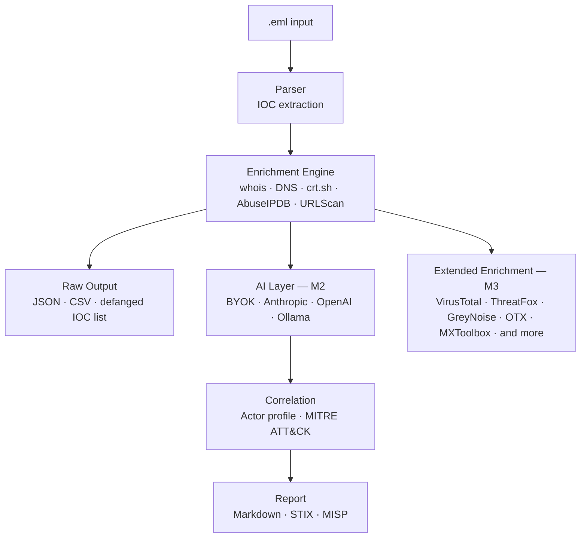

# PhishHawk 🦅

> Open source phishing analysis IOC extraction pipeline for threat intelligence analysts. 
> PhishHawk automates the manual workflow of phishing investigation - from raw `.eml`file to structured threat report. It extracts IOC's, enriches them against multiple threat intelligence sources, and exports results in formats compatible with common TI workflows. 
> Built for analysts who don't have an entire SOC team behind them.

---

## Features

**M1 — Core Pipeline**
- **EML Parser** — extracts IPs, domains, URLs, and sender data from email headers and body
- **Enrichment Engine** — automatically queries whois, DNS, crt.sh, AbuseIPDB, and URLScan
- **Raw Mode** — works without an AI/LLM API key, outputs structured data directly
- **Multiple output formats** — JSON, CSV, defanged IOC list

**M2 — Enrichment & Output** *(in progress)*
- **Redirect chain tracing** — passively traces URL redirect chains, logs each hop and final destination
- **AI correlation** — BYOK LLM support for actor profiling and MITRE ATT&CK mapping
- **Report generation** — human-readable Markdown threat report
- **STIX/TAXII export** — compatible with MISP and other TI platforms
- **Attachment extraction** — detects and hashes email attachments

**M3 — Enrichment Suite** *(planned)*
- **Plugin architecture** — enable/disable enrichment modules via config.yaml
- **Extended enrichment** — VirusTotal, ThreatFox, PhishTank, Google Safe Browsing, RDAP, HIBP, MalwareBazaar, Hybrid Analysis, GreyNoise, AlienVault OTX, MXToolbox
- **BYOK LLM** — Anthropic, OpenAI, and Ollama support

---

## Roadmap

| Milestone | Status | Description |
|---|---|---|
| M1 — Core Pipeline | ✅ Complete | Parser + enrichment + raw output |
| M2 — Enrichment & Output | 🔄 In Progress | AI correlation, MITRE mapping, redirect tracing, MISP/STIX export, report generation |
| M3 — Enrichment Suite | 📋 Planned | Plugin architecture + VirusTotal, ThreatFox, PhishTank, GreyNoise, AlienVault OTX, MXToolbox and more |

---

## Installation

```bash
git clone https://github.com/LauritsCSB/phishHawk.git
cd phishhawk
python3 -m venv .venv
```

**Mac/Linux**
```bash
source .venv/bin/activate
````

**Windows**
```bash
.venv\Scripts\activate
```

```bash
pip install -e .
```

---

## Configuration

```bash
cp config.example.yaml config.yaml
```

Edit `config.yaml` with your API keys:

```yaml
enrichment:
  # M1
  abuseipdb_api_key: "YOUR_ABUSEIPDB_API_KEY"
  urlscan_api_key: "YOUR_URLSCAN_API_KEY"

  # M3 — optional, enable modules in plugins section
  virustotal_api_key: "YOUR_VIRUSTOTAL_API_KEY"
  greynoise_api_key: "YOUR_GREYNOISE_API_KEY"
  hybrid_analysis_api_key: "YOUR_HYBRID_ANALYSIS_API_KEY"

llm:
  provider: "anthropic"  # anthropic, openai, or ollama
  api_key: "YOUR_API_KEY"
  model: "claude-sonnet-4-20250514"

output:
  format: "markdown"
  defang: true
  output_dir: "./reports"

# M3 — enable/disable enrichment modules
plugins:
  enabled:
    - abuseipdb
    - urlscan
  disabled:
    - virustotal
    - threatfox
    - phishtank
    - google_safe_browsing
    - hibp
    - malwarebazaar
    - hybrid_analysis
    - greynoise
    - alienvault_otx
    - mxtoolbox
```

---

## Usage

```bash
# Coming in M2
```

---

## Output Formats

| Format | Description |
|---|---|
| JSON | Full enriched dataset, machine-readable |
| CSV | Flat IOC list for spreadsheet tools |
| TXT | Defanged IOC list for safe sharing |
| Markdown | Human-readable threat report (M2) |
| STIX/TAXII | Compatible with MISP and TI platforms (M2) |

---

## Architecture



---

## API Keys

| Service | Free Tier | Required | Milestone |
|---|---|---|---|
| AbuseIPDB | 1,000 requests/day | Yes | M1 |
| URLScan.io | 5,000 scans/month | Yes | M1 |
| Anthropic / OpenAI / Ollama | Varies | No (raw mode available) | M2 |
| VirusTotal | 500 requests/day | No | M3 |
| ThreatFox (abuse.ch) | Unlimited | No | M3 |
| PhishTank | Unlimited | No | M3 |
| Google Safe Browsing | 10,000 requests/day | No | M3 |
| Have I Been Pwned | Limited | No | M3 |
| MalwareBazaar (abuse.ch) | Unlimited | No | M3 |
| Hybrid Analysis | 200 requests/day | No | M3 |
| GreyNoise | 1,000 requests/day | No | M3 |
| AlienVault OTX | Unlimited | No | M3 |
| MXToolbox | Limited | No | M3 |

---

## License

MIT - free to use, modify, and distribute.

---

## Author

Built by Laurits Bentsen (LinkedIn: www.linkedin.com/in/laurits-bentsen-311491a8) as part of a career transition from paramedicine til cybersecurity.
